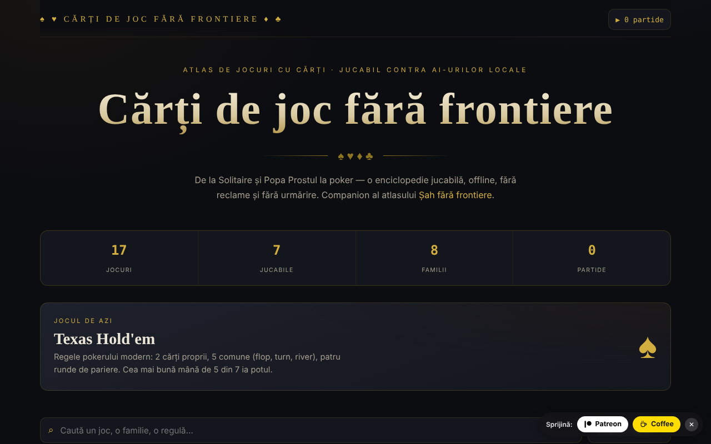

# Cărți de joc fără frontiere

Atlas de jocuri cu cărți, cu șapte jocuri jucabile, într-un singur fișier HTML.

**Live:** https://chiuta.github.io/Carti-de-joc-fara-frontiere/

## Ce este

Un atlas interactiv de jocuri cu cărți, de la Solitaire și Popa Prostul până la poker, descris în aplicație drept „enciclopedie jucabilă, offline, fără reclame și fără urmărire”. Catalogul grupează jocurile pe familii; pentru fiecare joc există o fișă cu informații și reguli, iar o parte dintre ele pot fi jucate direct în pagină. Este companionul atlasului „Șah fără frontiere”.

## Funcții

- Catalog cu 17 jocuri, grupate în familii: Pentru copii & rapide, Jocuri românești, De aruncare, Cu levate, Combinații & remi, Familia pokerului, Cazinou & pariuri, Pacient (solitaire).
- Șapte jocuri jucabile (conform notei din subsol): Solitaire (Klondike), Război, Popa Prostul, Macao, Septică, Blackjack și Texas Hold'em. Restul sunt documentate.
- Căutare în titluri, descrieri, etichete și reguli („Caută un joc, o familie, o regulă…”).
- Sortare: grupare pe familii, alfabetic A→Z, dificultate crescătoare, jucabile întâi.
- Filtre pe familii, plus filtrul „★ Doar jucabile”.
- Fișă de joc cu număr de jucători, epocă, dificultate; marcare ca favorit (★).
- Joc zilei și contor de statistici (jocuri, jucabile, familii, partide jucate).
- Buton **▶ Joacă** în fișa fiecărui joc jucabil; **Închide** / ✕ / **Esc** pentru ieșire.

## Manual de utilizare

1. Deschide pagina; sus vezi statisticile și jocul zilei.
2. Caută în câmpul de căutare sau alege o familie din chip-uri; schimbă ordinea din lista de sortare.
3. Apasă pe un joc pentru a deschide fișa cu reguli. Apasă ★ din fișă pentru a-l marca favorit.
4. Dacă jocul este marcat „Jucabil”, apasă **▶ Joacă** și urmează indicațiile de pe masă.
5. Închide fișa sau masa de joc cu **Închide**, ✕ sau **Esc**.
6. Contorul „▶ N partide” din colțul de sus arată câte partide ai început.

## Avertisment

Jocurile (inclusiv Blackjack și Texas Hold'em, din familia „Cazinou & pariuri") sunt simulări educaționale cu jetoane virtuale; nu se mizează bani reali. Jocurile de noroc pe bani pot crea dependență și sunt destinate adulților. Adversarii din jocurile jucabile sunt programe locale (aplicația le numește „AI-uri locale"); aplicația afișează o notă în subsol.

## Confidențialitate și rețea

- **Stocare locală (localStorage):** două chei cu prefix `cff:`, `cff:fav` (jocurile favorite) și `cff:played` (numărul de partide). Nu sunt trimise nicăieri.
- **Rețea:** nu există cereri `fetch`, scripturi, fonturi sau imagini externe. Pagina include doar linkuri care se deschid la clic: Șah fără frontiere (alexio.tf), Patreon și Buy Me a Coffee. Pagina are o politică CSP restrictivă (`default-src 'self'`). Nu există telemetrie.

## Rulare locală / offline

Descarcă `index.html` și deschide-l în browser; nu are nevoie de internet (linkurile externe au nevoie).

## Licență

CC0 1.0 Universal (dedicare în domeniul public) — vezi fișierul `LICENSE`. Antetul din `index.html` și textul din interfață indică aceeași licență (o mențiune anterioară „CC-BY-SA 4.0” din interfață a fost eliminată la audit, 2026-10-11, pentru a elimina contradicția).

## Mărci

Numele de jocuri sunt denumiri comerciale ale deținătorilor lor, folosite descriptiv; proiectul nu este afiliat cu aceștia.

## Audit

Audit: 2026-10-10 — verificat cu Playwright și axe-core (catalog, fișe și mesele celor șapte jocuri); verificat în cod: fără `fetch`, CSP `default-src 'self'`. Corectat: un checkbox decorativ focalizabil (axe serious); adăugat avertisment despre jocurile de noroc.

## Autor

Alexio — Alexandru-Ionuț Chiuță, Centrul StrING (după cum este menționat în aplicație). Contact: alexio@trom.tf

## English summary

Cărți de joc fără frontiere is a single-file atlas of 17 card games grouped by family, with search, sorting, favourites and seven playable games (Klondike Solitaire, War, Popa Prostul, Macao, Septică, Blackjack, Texas Hold'em). It stores only favourites and a played-games counter in localStorage and loads no external resources. UI is in Romanian. Licensed CC0 1.0 (see LICENSE).
